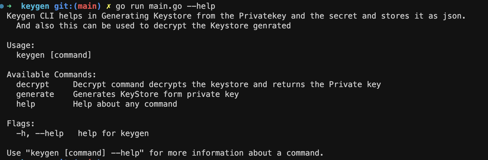

  

# Keygen

  

## Description

This project is a go library used to generate the keystore containing your private key and public key. 

## Prerequisites

Keygen requires you to [Download and install](https://go.dev/dl/) GoLang onto your local machine.

## Setup

You can generate your encrypted keystore in the following way

### Clone the Repository

Clone the git repository using

` git Clone https://github.com/HugoByte/keygen.git `

## Usage

  

### Build the library

  

Build the library

  

`go build`

  

This will build the binary required for your keystore.

#### screenshot

  

### Generate

You can run the keygen command with the following flags and its required arguments.

Set a password for your keystore using the **-p** flag

  

`keygen generate -p <your_password> -o <Output filepath / Output Filename>`

  

### Decrypt

You can decrypt the library files only using your password

  

`keygen decrypt -f <file_name> -p <your_password>`

  

#### License

  

Licensed under [Apache-2.0](https://www.apache.org/licenses/LICENSE-2.0)